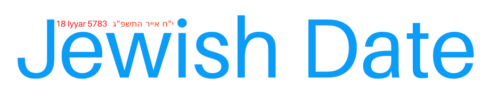

<h1 align="center">
<a href="https://github.com/Shmulik-Kravitz/jewish-date"></a>
</h1>

<p align="center">Jewish Date is a fast and modern <b>2kb</b> alternative to hebcal with an MIT license.</p>
<p align="center">
  <a href="https://www.npmjs.com/package/jewish-date">
    
  </a>
  <a href="https://unpkg.com/jewish-date@*/dist/index.js">
    
  </a>
  <a href="https://github.com/Shmulik-Kravitz/jewish-date/blob/master/LICENSE">
    
  </a>
  
  
</p>

> Jewish Date is a fast and modern 2kB JavaScript library that provides a simple and efficient Gregorian-to-Hebrew and vice versa date converter. With an MIT license and seamless compatibility with all browsers, node.js, and TypeScript, Jewish Date is a reliable and efficient date converter that can help you convert dates between the Hebrew and Gregorian calendars with ease.


- 📦 2kb mini library (minified & gzip)
- 📜 MIT License
- 🔧 Easy to use
- 💻 Seamless compatibility with both Node.js and the browser

# Getting Started

## Installation

```console
yarn add jewish-date
```

Or with npm

```console
npm install jewish-date --save
```

## Usage

### TypeScript & ES6 example

```js
import {
  toJewishDate,
  formatJewishDate,
  toHebrewJewishDate,
  formatJewishDateInHebrew,
  toGregorianDate,
  JewishMonth,
} from "jewish-date";

const date = new Date(2023, 4, 9); // the month is 0-indexed (4 = May)
const jewishDate = toJewishDate(date);
console.log(jewishDate); // { year: 5783, monthName: "Iyyar", month: 8, day: 18 }

const jewishDateInEnglish = formatJewishDate(jewishDate);
console.log(jewishDateInEnglish); // 18 Iyyar 5783

const jewishDateInHebrew = toHebrewJewishDate(jewishDate);
console.log(jewishDateInHebrew); // { day: "י״ח", monthName: "אייר", year: "התשפ״ג" }

const jewishDateInHebrewStr = formatJewishDateInHebrew(jewishDate);
console.log(jewishDateInHebrewStr); // י״ח אייר התשפ״ג

const date2 = toGregorianDate({
  year: 5783,
  monthName: JewishMonth.Iyyar,
  day: 18,
});
console.log(date2); // Tue May 09 2023 00:00:00 GMT+0300 (Israel Daylight Time)
```

#### For ES5

Replace

```js
import {
  toJewishDate,
  formatJewishDate,
  toHebrewJewishDate,
  formatJewishDateInHebrew,
  toGregorianDate,
  JewishMonth,
} from "jewish-date";
```

With

```js
const {
  toJewishDate,
  formatJewishDate,
  toHebrewJewishDate,
  formatJewishDateInHebrew,
  toGregorianDate,
  JewishMonth,
} = require("jewish-date");
```

# License

Jewish Date is licensed under a [MIT License](https://github.com/Shmulik-Kravitz/jewish-date/blob/master/LICENSE).
